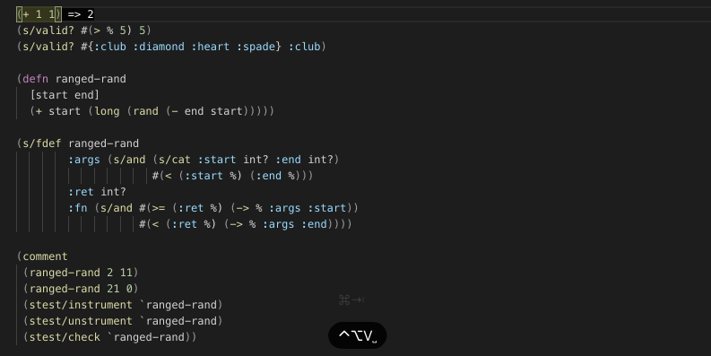

# Clojure 4 VS Code

[Clojure and ClojureScript support.](https://marketplace.visualstudio.com/items?itemName=cospaia.clojure4vscode). nREPL powered. Emacs CIDER inspired.

## Raison d´être

Try to bring as much of the Emacs CIDER experience as I can to VS Code. Supporting both Clojure and ClojureScript.



You think this extension looks very similar to the visual:clojure extension? It's because it is based on that one. 🤠

This extensions then adds some tricks:
- Running tests through the REPL connection, and mark them in the Problems tab
    - Run namespace tests: `alt+v t`
    - Run all tests: `alt+v a`
    - User setting to evaluate namespace on save/open file (defaults to **on**)
- Evaluate code and show the results as annotation in the editor: `alt+v e`
- Evaluate code and replace it in the editor, inline: `alt+v r`
- Pretty printing evaluation resuls: `alt+v p`
- Support for `cljc` files and you can choose if they should be evaluated by the `clj` or the `cljc` repl session.
- Enables `clj` repl for all files/editors. You now can evaluate those clojure code snippets in Markdown files.
- Error information when evaluation fails (at least a hint)

NB: **You shouldn't run both extensions, beacuse that will get very confused.**

Demo: Peek at defintions, etcetera:


Demo lint errors are marked in the editor. (As are unit test failures)


## Current features
* Intellisense
* Underlining compile-time errors
* Go to / Peek at definition
* View docstrings on hover
* View function signatures on hover
* Interactive REPL From visual code
  * Compile files
  * Evaluate forms
    * Pretty printed results (if you want to)
    * Replace evaluated code with the result
  * Run tests
    * Failed tests added to Problems tab/diagnostics
    * Run all tests or tests for current namespace
  * Auto-connects to existing repl using 'repl-port'-file
* Supports all clojure filetypes, clj, cljc and cljs.
 * When editing `cljc` files, easily choose if repl commands should go to the `clj` or `cljc` repl
* Enables `clj` repl in all files (not just Clojure files).

Demo switch between clj and cljs repl sessions for cljc files:


## Future stuff
* When editing `cljc` files, easily choose if repl commands should go to the `clj` or `cljc` repl. (They currently always go to the Clojure repl.)
* I want an integrated REPL!
* Let me know what you want. PRs welcome, file an issue or tweet me: [@pappapez](https://twitter.com/pappapez)

## Dependencies
* Uses nrepl for evaluation / communication
* Uses cider-nrepl for added nrepl functionality

Best place, imho, to configure them is in the `~/.lein/profiles.clj` like so:

```
{:user {:plugins [[cider/cider-nrepl "0.16.0"]]
        :dependencies [[org.clojure/tools.nrepl "0.2.12"]]}
```

If you are only using Clojure then you are all set.

### For Clojurescript

Add piggiback and its nrepl middleware `wrap-cljs-repl`:

```
{:user {:plugins [[cider/cider-nrepl "0.16.0"]]
        :dependencies [[com.cemerick/piggieback "0.2.2"]
                       [org.clojure/tools.nrepl "0.2.12"]]
        :repl-options {:nrepl-middleware [cemerick.piggieback/wrap-cljs-repl]}}}
```

## Connecting to the REPL

Clojure 4 VS Code will automatically connect to the nrepl session, but it does not start the repl for you. Start it from the terminal/command prompt if it is not running. Leiningen users do it like so:

```
$ lein repl
```

Adding whatever options you need. WHen the repl has started, if you only use Clojure, start VS Code and open the project root directory. The extension will then connect, and you are ready to bend the laws of nature using Clojure.

Yay! 🍾 🎆 ✨

### ClojureScript REPL

If you want to use ClojureScript, you start its repl off of the repl you have just started, i.e. **not** using `lein figwheel` because then the extension will not know how to connect. Open the porject in VS Code and the extension will connect to the ClojureScript repl for `cljs` files and to the Clojure repl for `clj` and `cljc` files.

Yay! 🥂 🤘 🍻

Read on for some pointers on this if you are not familiar.

#### Figwheel

Most people use Figwheel (bacause awesome).

**To initiate a figwheel-repl you need the figwheel-sidecar dependency -> [figwheel-sidecar "0.5.8"] as well correct cljs classpaths**
read more about this [here](https://github.com/bhauman/lein-figwheel/wiki/Using-the-Figwheel-REPL-within-NRepl)

If you have created a figwheel-project from a template (using e.g. lein new), you should be good to go as long as you start the repl in the projects folder.

Having started the initial repl like above with ```lein repl```, initiate figwheel from there (beacuse reasons stated above). Then:

```
 (use 'figwheel-sidecar.repl-api)
 (start-figwheel!)
 (cljs-repl)
```

I can recommend adding a start function to your projects `dev` namespace to pack these calls into something like:

```
dev=> (start)
```

#### W/o Figwheel

If you want to start a ClojureScript REPL-session sans Figwheel, you can start this from the existing clojure-REPL that we just created.
Using piggieback we can initiate a cljs-repl using e.g. rhino:

Run the following command in the REPL to start a cljs-session with rhino: ```(cemerick.piggieback/cljs-repl (cljs.repl.rhino/repl-env))```

## Control the connection to the active REPL from vscode

The extension connects automatically, but if you need to restart the repl you might need to connect it explicitly:
Use the command `clojure4vscode: Connect to an existing nREPL session` (shortcut:  `alt+v c`).
An input-field is displayed showing default host and port. Submit and you will get the repl connection restored.

There are 3 different states that the extensions connection can be in:
 
 
 

## Happy coding

I hope you will find tons of use for this extension! Please let me know what you think or want. PRs welcome, file an issue or tweet me: [@pappapez](https://twitter.com/pappapez)

❤️

**Clojure 4 VS Code** works nicely together with [Paredit](https://marketplace.visualstudio.com/items?itemName=clptn.code-paredit) and [Parinfer](https://marketplace.visualstudio.com/items?itemName=shaunlebron.vscode-parinfer).