# Paredit – a Visual Guide

Structural editing and navigation for Clojure.

## What is Paredit?

Calva Paredit helps you navigate, select and edit Clojure code in a structural way. LISP isn't line or character oriented, it is based around [S-expressions](https://en.wikipedia.org/wiki/S-expression), a.k.a forms. We strongly recommend that you take advantage of the structural nature of Clojure, and have therefore put a lot of work into making Calva Paredit extra awesome.

If you are new to Paredit, start with learning the **Slurp Forward** (pull in the next form into this form) and **Barf Forward** (push the last form out of this form).

## Strict Mode

To protect the integrity of your code, **Strict mode** is enabled by default.

Strict mode keybinding              | Action | Description
----------------------              | ------ | -----------
 `backspace`                | **Delete Backward** | Deletes one character backwards, unless it will unbalance a form. Otherwise moves past the character instead of deleting it. If the list is empty, it will remove both open and close brackets.   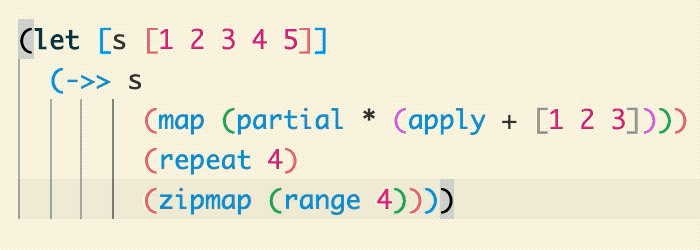
 `delete`                   | **Delete Forward** | Deletes one character forwards, unless it will unbalance a form. Otherwise moves past the character instead of deleting it. If the list is empty, it is removed.   
 `alt+backspace` | **Force Delete Backward** | Deletes one character backwards, even if it will unbalance a form.   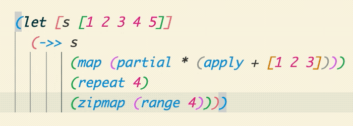
 `alt+delete`    | **Force Delete Forward** | Deletes one character forwards, even if it will unbalance a form.   

_Disable at your own peril._ Strict mode can be toggled on/off using the **Toggle Paredit Mode** command, and there is a status bar indicator telling you: 

Indicator | Paredit Mode
:-------: | ------
`[λ]`     | Strict
`(λ)`     | Cave Man
 `λ`      | No default key bindings

Toggle bewteen Strict and Cave Man using: `ctrl+alt+p ctrl+alt+m`

## Commands

The Paredit commands sorts into **Navigation**, **Selection**, and **Edit**. As mentioned, **Slurp** and **Barf** are power commands, which go into the editing category. Learning to navigate structurally, using shortcuts, also saves time and adds precision to your editing. It has the double effect that you at the same time learn how to select structurally, because that is the same, just adding the shift key.

To make the command descriptions a bit clearer, each entry is also animated. When you try to figure out what is going on in the GIFs, focus on where the cursor is at the start of the animation loop.

### Strings are not Lists, but Anyway...

In Calva Paredit, strings are treated in much the same way as lists are. Here's an example showing **Slurp** and **Barf**, **Forward/Backward List**, and **Grow Selection**.

 

### Navigating

(Modify these with`shift` to select rather than move, see below.)

Default keybinding      | Action | Description
------------------      | ------ | -----------
 `ctrl+alt+right`          | **Forward Sexp** | Moves the cursor forward, to the end of the current form. If at the end, moves to the end of the next form. Will not move out of lists.   
 `ctrl+alt+left`           | **Backward Sexp** | Moves the cursor backward, to the start of the current form. If at the start, moves to the start of the previous form. Will not move out of lists.  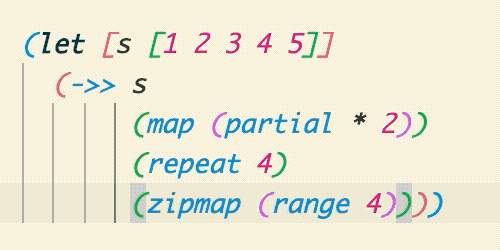
 `ctrl+down`               | **Forward Down Sexp** | Moves the cursor into the following list.  
 `ctrl+alt+up`             | **Backward Down Sexp** | Moves the cursor into the preceding list.  
 `ctrl+alt+down`           | **Forward Up Sexp** | Moves the cursor forwards, out of the current list.  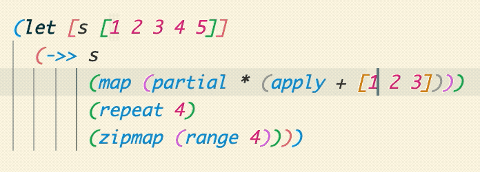
 `ctrl+up`                 | **Backward Up Sexp** | Moves the cursor backwards, out of the current list.  
 `ctrl+end`                | **Forward to List End/Close** | Moves the cursor forwards, staying within the current list.  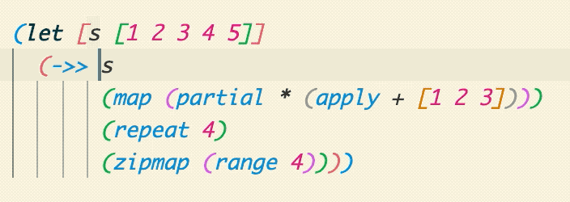
 `ctrl+home`               | **Backward to List Start/Open** | Moves the cursor backwards, staying within the current list.  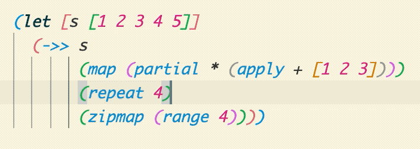 

### Selecting

Default keybinding    | Action | Description
------------------    | ------ | -----------
 `ctrl+w`                | **Expand Selection** | Starts from the cursor and selects the current form. Then will keep expanding to enclosing forms.  
 `ctrl+shift+w`          | **Shrink Selection** | Contracts back from an expanded selection performed by any Paredit selection command.   (In the animation the selection is first grown using a combination of **Grow Selection** and some lateral selection commands, then shrunk all the way back down to no selection.)
 `ctrl+alt+w space`      | **Select Current Top Level Form** | Top level in a structural sence. Typically where your`(def ...)`/`(defn ...)` type forms. Please note that`(comment ...)` forms create a new top level.    

The selecting ”versions” of the navigation commands above. They will all grow whatever current selection as far as the **Shrink Selection** command is concerned.

Default keybinding    | Action | Description
------------------    | ------ | --------------
 `ctrl+shift+alt+right`  | **Select Forward Sexp** |  
 `ctrl+shift+alt+left`   | **Select Backward Sexp** | 
 `ctrl+shift+down`       | **Select Forward Down Sexp** | 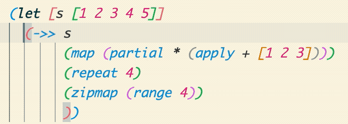  (You probably do not need to select like this, but you can!)
 `ctrl+shift+alt+up`     | **Select Backward Down Sexp** |   (You probably do not need to select like this, but you can!)
 `ctrl+shift+alt+down`   | **Select Forward Up Sexp** | 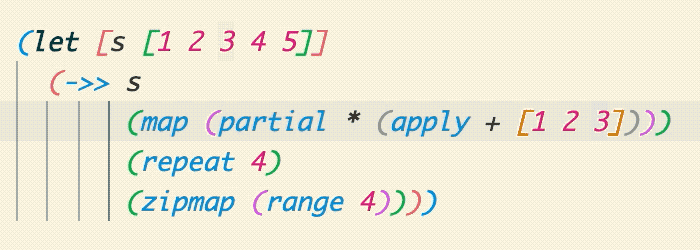  (You probably do not need to select like this, but you can!)
 `ctrl+shift+up`         | **Select Backward Up Sexp** | 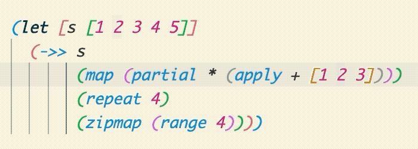  (You probably do not need to select like this, but you can!)
 `ctrl+shift+end`        | **Select Forward to List End/Close** | 
 `ctrl+shift+home`       | **Select Backward to List Start/Open** | 

(Earlier versions of Calva had commands for copying, cutting and deleting that corresponded to all movements. This has now been replaced with this selection commands, and you can choose to copy/cut/delete once you have the selection.)

### Editing

Default keybinding                | Action | Description
------------------                | ------ | -----------
 `ctrl+right`                        | **Slurp Forward** |  Moves the _closing_ bracket _forward_, _away_ from the cursor, past the following form, if any.   
 `ctrl+left`                         | **Barf Forward** | Moves the _closing_ bracket _backward_, _towards_ the cursor, past the preceding form.   
 `ctrl+shift+left`                   | **Slurp Backward** | Moves the _opening_ bracket _backward_, _away_ from the cursor, past the preceding form, if any.   
 `ctrl+shift+right`                  | **Barf Backward** | Moves the _opening_ bracket _forward_, _towards_ the cursor, past the following form.   
 `ctrl+alt+s`                      | **Splice Current Sexp/Form** | Remove enclosing brackets.   
 `ctrl+shift+s`                  | **Split Current Sexp/Form** | Splits a string, or a list, into two strings, or lists of the same type as the current.   
 `ctrl+shift+j`                  | **Join Sexps/Forms** | Joins two strings, or two lists of the same type, into one form (string/list).   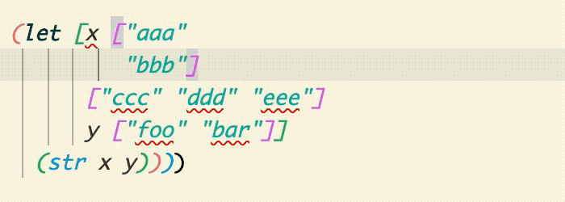
 `ctrl+alt+p ctrl+alt+r`                        | **Raise Current Sexp/Form** | Replaces the enclosing list with the current form.   
 `ctrl+alt+t`                        | **Transpose Sexps/Forms** | Swaps place of the two forms surrounding the cursor.   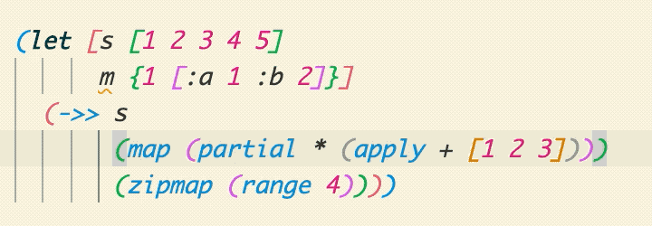
 `ctrl+alt+shift`  `l`  `ctrl+alt+shift`  `r` | **Push Sexp/Form Left/Right** | Moves the current form to the left/right of the previous/next one.   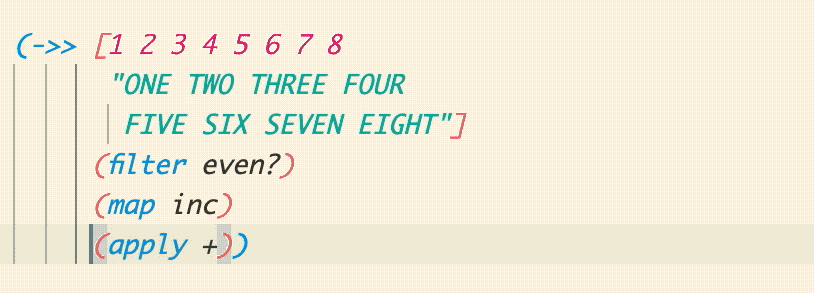
 `ctrl+shift+c`                      | **Convolute Current Sexp/Form** | ¯\\\_(ツ)_/¯   
 `ctrl+shift+delete`                   | **Kill Sexp/Form Forward** | Deletes the next form in the same enclosing form as the cursor.  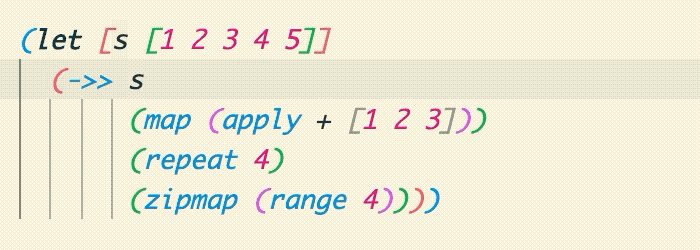
 `ctrl+alt+backspace`                | **Kill Sexp/Form Backward** | Deletes the previous form in the same enclosing form as the cursor.  
 `ctrl+delete`                       | **Kill List Forward** | Deletes everything from the cursor to the closing of the current enclosing form.  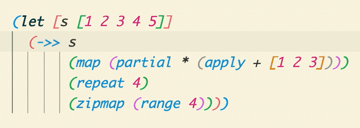
 `ctrl+backspace`                    | **Kill List Backward** | Deletes everything from the cursor to the opening of the current enclosing form.  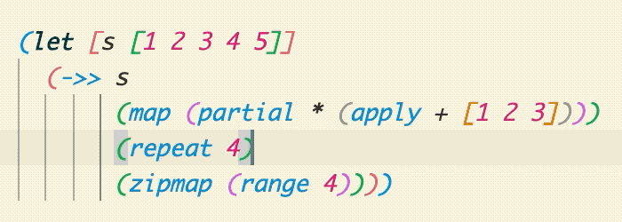 
 `ctrl+alt+shift+delete`                 | **Splice Killing Forward** | Delete forward to end of the list, then Splice.   
 `ctrl+alt+shift+backspace`              | **Splice Killing Backwards** | Delete backward to the start of the list, then Splice.    
 `ctrl+alt+shift+p`                        | **Wrap Around ()** | Wraps the current form, or selection, with parens.   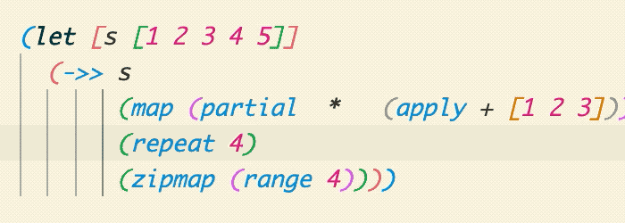
 `ctrl+alt+shift+s`                        | **Wrap Around []** | Wraps the current form, or selection, with square brackets.   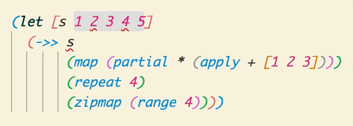
 `ctrl+alt+shift+c`                        | **Wrap Around {}** | Wraps the current form, or selection, with curlies.   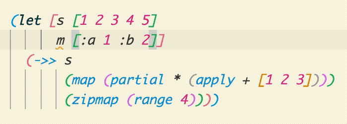
 `ctrl+alt+shift+q`                        | **Wrap Around ""** | Wraps the current form, or selection, with double quotes. Inside strings it will quote the quotes.   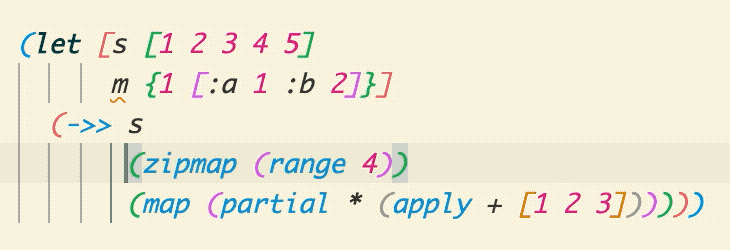
 `ctrl+alt+r` `p`/`s`/`c`/`q`                        | **Rewrap** | Changes enclosing brackets of the current form to parens/square brackets/curlies/double quotes..   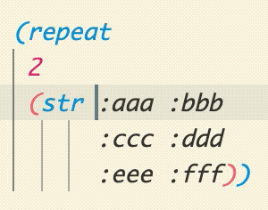

## About the Keyboard Shortcuts

Care has been put in to making the default keybindings somewhat logical, easy to use, and work with most keyboard layouts. Slurp and barf forward are extra accessible to go with the recommendation to learn using these two super handy editing commands.

Note: You can choose to disable all default key bindings by configuring `calva.paredit.defaultKeyMap` to `none`. (Then you probably also want to register your own shortcuts for the commands you often use.)

If you add your own key bindings, please be aware that [shortcuts with typable characters will work badly in the the REPL window](https://github.com/microsoft/vscode/issues/85879). Please avoid.

Happy Editing! ❤️