# Paredit – a Visual Guide

Structural editing and navigation for Clojure.

## What is Paredit?

Calva Paredit helps you navigate, select and edit Clojure code in a structural way. LISP isn't line or character oriented, it is based around [S-expressions](https://en.wikipedia.org/wiki/S-expression), a.k.a forms. We strongly recommend that you take advantage of the structural nature of Clojure, and have therefore put a lot of work into making Calva Paredit extra awesome.

If you are new to Paredit, start with learning the **Slurp Forward** (pull in the next form into this form) and **Barf Forward** (push the last form out of this form).

NB: **Strict mode** (see below) is enabled by default. _Disable it at your own peril._ Instead, when you want to delete something that strict mode hinders, use **Force backspace** and **Force delete** (which are the normal, brute, **backspace** and **delete** that you might be used to). Strict mode can be switched off by configuring `calva.paredit.defaultKeyMap` to `original`.

## Commands

Here you will find the Paredit commands sorted into **Navigating**, **Selecting**, and **Editing**. As mentioned, **slurp** and **barf** are real power commands. Learning to navigate structurally, saves time and adds precision to your editing, and it has the double effect that if you learn a shortcut for navigation, say **Forward/Backward Sexp/Form**, you have at the same time learnt how to select code using shortcuts, because that is the same, just adding the shift key.

To make the command descriptions a bit clearer, each of them are also animated. When you try to figure out what is going on in the GIFs, focus on where the cursor is at the start of the animation loop.

### Strings are not Lists, but Anyway...

In Calva Paredit, strings are treated in much the same way as lists are. Here's an example showing **Slurp** and **Barf**, **Forward/Backward List**, and **Grow Selection**.

 

### Navigating

Default keybinding      | Action | Description
------------------      | ------ | -----------
<kbd>ctrl</kbd> <kbd>alt</kbd> <kbd>right</kbd>          | **Forward Sexp/Form** | Moves the cursor forward, to the end of the current form. If at the end, moves to the end of the next form. Will not move out of lists.  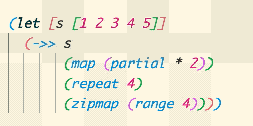 
<kbd>ctrl</kbd> <kbd>alt</kbd> <kbd>left</kbd>           | **Backward Sexp/Form** | Moves the cursor backward, to the start of the current form. If at the start, moves to the start of the previous form. Will not move out of lists.  
<kbd>ctrl</kbd> <kbd>down</kbd>               | **Forward Down Sexp/Form** | Moves the cursor into the following list.  
<kbd>ctrl</kbd> <kbd>alt</kbd> <kbd>up</kbd>             | **Backward Down Sexp/Form** | Moves the cursor into the preceding list.  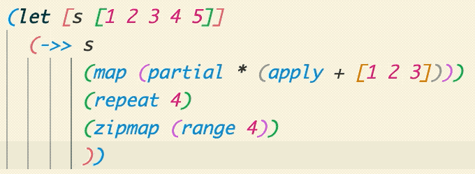
<kbd>ctrl</kbd> <kbd>alt</kbd> <kbd>down</kbd>           | **Forward Up Sexp/Form** | Moves the cursor forwards, out of the current list.  
<kbd>ctrl</kbd> <kbd>up</kbd>                 | **Backward Up Sexp/Form** | Moves the cursor backwards, out of the current list.  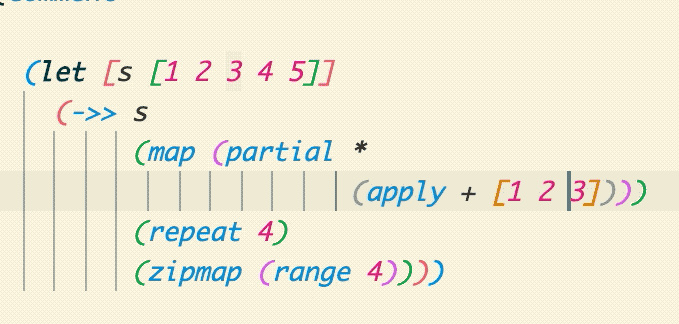
<kbd>ctrl</kbd> <kbd>end</kbd>                | **Forward to List End/Close** | Moves the cursor forwards, staying within the current list.  
<kbd>ctrl</kbd> <kbd>home</kbd>               | **Backward to List Start/Open** | Moves the cursor backwards, staying within the current list.   

(Modify these with `shift` to select rather than move.)

### Selecting

Default keybinding    | Action | Description
------------------    | ------ | -----------
<kbd>ctrl</kbd> <kbd>w</kbd>                | **Expand Selection** | Starts from the cursor and selects the current form. Then will keep expanding to enclosing forms.  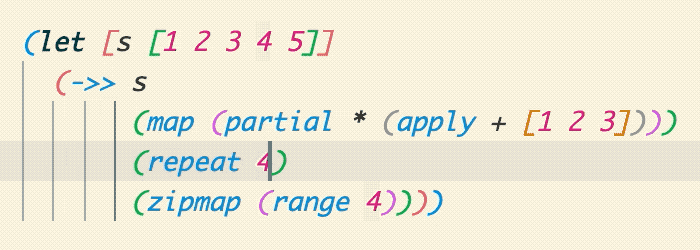
<kbd>ctrl</kbd> <kbd>shift</kbd> <kbd>w</kbd>          | **Shrink Selection** | Contracts back from an expanded selection.  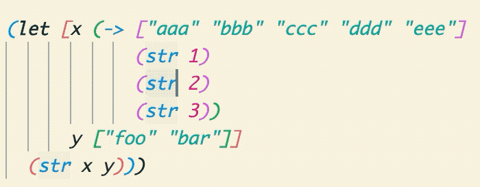
<kbd>ctrl</kbd> <kbd>alt</kbd> <kbd>w</kbd>, <kbd>space</kbd>      | **Select Current Top Level Form** | Top level in a structural sence. Typically where your `(def ...)`/`(defn ...)` type forms. Please note that `(comment ...)` forms create a new top level.  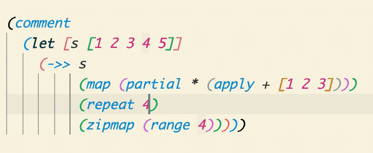 

The selecting ”versions” of the navigation commands above:

Default keybinding    | Action | Description
------------------    | ------ | --------------
<kbd>ctrl</kbd> <kbd>shift</kbd> <kbd>alt</kbd> <kbd>right</kbd>  | **Select Forward Sexp/Form** | 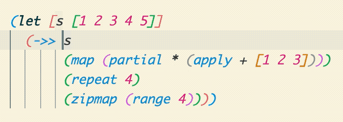 
<kbd>ctrl</kbd> <kbd>shift</kbd> <kbd>alt</kbd> <kbd>left</kbd>   | **Select Backward Sexp/Form** | 
<kbd>ctrl</kbd> <kbd>shift</kbd> <kbd>down</kbd>       | **Select Forward Down Sexp/Form** |   (You probably do not need to select like this, but you can!)
<kbd>ctrl</kbd> <kbd>shift</kbd> <kbd>alt</kbd> <kbd>up</kbd>     | **Select Backward Down Sexp/Form** |   (You probably do not need to select like this, but you can!)
<kbd>ctrl</kbd> <kbd>shift</kbd> <kbd>alt</kbd> <kbd>down</kbd>   | **Select Forward Up Sexp/Form** |   (You probably do not need to select like this, but you can!)
<kbd>ctrl</kbd> <kbd>shift</kbd> <kbd>up</kbd>         | **Select Backward Up Sexp/Form** |   (You probably do not need to select like this, but you can!)
<kbd>ctrl</kbd> <kbd>shift</kbd> <kbd>end</kbd>        | **Select Forward to List End/Close** | 
<kbd>ctrl</kbd> <kbd>shift</kbd> <kbd>home</kbd>       | **Select Backward to List Start/Open** | 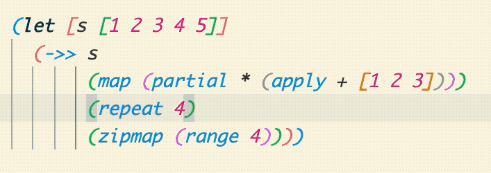

### Editing

Default keybinding                | Action | Description
------------------                | ------ | -----------
<kbd>ctrl</kbd> <kbd>right</kbd>                        | **Slurp Forward** |  Moves the _closing_ bracket _forward_, _away_ from the cursor, past the following form, if any.   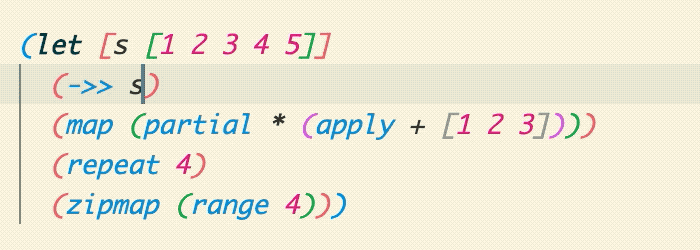
<kbd>ctrl</kbd> <kbd>left</kbd>                         | **Barf Forward** | Moves the _closing_ bracket _backward_, _towards_ the cursor, past the preceding form.   
<kbd>ctrl</kbd> <kbd>shift</kbd> <kbd>left</kbd>                   | **Slurp Backward** | Moves the _opening_ bracket _backward_, _away_ from the cursor, past the preceding form, if any.   
<kbd>ctrl</kbd> <kbd>shift</kbd> <kbd>right</kbd>                  | **Barf Backward** | Moves the _opening_ bracket _forward_, _towards_ the cursor, past the following form.   
<kbd>ctrl</kbd> <kbd>alt</kbd> <kbd>s</kbd>                      | **Splice Current Sexp/Form** | Remove enclosing brackets.   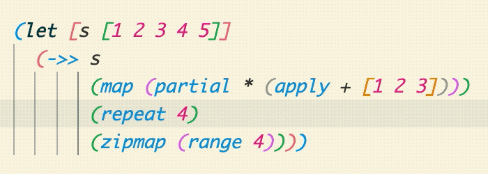
<kbd>ctrl</kbd> <kbd>shift</kbd> <kbd>s</kbd>                  | **Split Current Sexp/Form** | Splits a string, or a list, into two strings, or lists of the same type as the current.   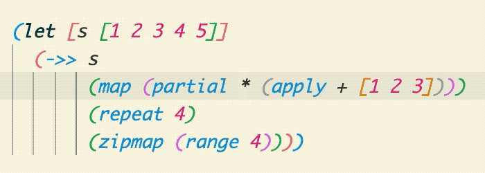
<kbd>ctrl</kbd> <kbd>shift</kbd> <kbd>j</kbd>                  | **Join Sexps/Forms** | Joins two strings, or two lists of the same type, into one form (string/list).   
<kbd>ctrl</kbd> <kbd>alt</kbd> <kbd>r</kbd>                        | **Raise Current Sexp/Form** | Replaces the enclosing list with the current form.   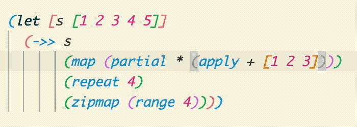
<kbd>ctrl</kbd> <kbd>shift</kbd> <kbd>c</kbd>                      | **Convolute Current Sexp/Form** | ¯\\\_(ツ)_/¯   
<kbd>ctrl</kbd> <kbd>shift</kbd> <kbd>delete</kbd>                   | **Kill/Delete One Sexp/Form Forward** |    
<kbd>ctrl</kbd> <kbd>alt</kbd> <kbd>backspace</kbd>                | **Kill/Delete One Sexp/Form Backward** |   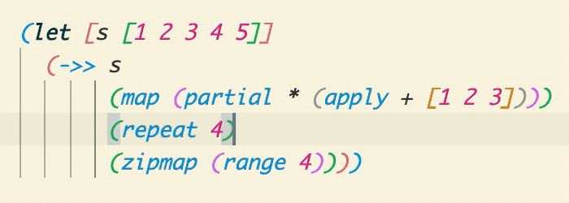
<kbd>ctrl</kbd> <kbd>delete</kbd>                       | **Kill/Delete Forward to End of List** |   
<kbd>ctrl</kbd> <kbd>backspace</kbd>                    | **Kill/Delete Backward to Start of List** |    
<kbd>ctrl</kbd> <kbd>alt</kbd> <kbd>shift</kbd> <kbd>delete</kbd>                 | **Splice Killing Forward** | Delete forward to end of the list, then Splice.   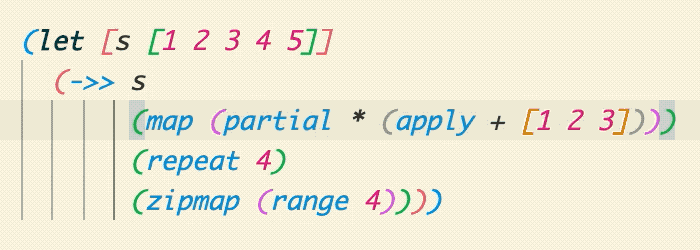
<kbd>ctrl</kbd> <kbd>alt</kbd> <kbd>shift</kbd> <kbd>backspace</kbd>              | **Splice Killing Backwards** | Delete backward to the start of the list, then Splice.    
<kbd>ctrl</kbd> <kbd>alt</kbd> <kbd>shift</kbd> <kbd>p</kbd>                        | **Wrap Around ()** | Wraps the current form, or selection, with parens.   
<kbd>ctrl</kbd> <kbd>alt</kbd> <kbd>shift</kbd> <kbd>s</kbd>                        | **Wrap Around []** | Wraps the current form, or selection, with square brackets.   
<kbd>ctrl</kbd> <kbd>alt</kbd> <kbd>shift</kbd> <kbd>c</kbd>                        | **Wrap Around {}** | Wraps the current form, or selection, with curlies.   

There is also a **strict** mode:

Strict mode keybinding              | Action | Description
----------------------              | ------ | -----------
<kbd>backspace</kbd>                | **Delete Backward** | Deletes one character backwards, unless it will unbalance a form. Otherwise moves past the character instead of deleting it.   
<kbd>delete</kbd>                   | **Delete Forward** | Deletes one character forwards, unless it will unbalance a form. Otherwise moves past the character instead of deleting it.   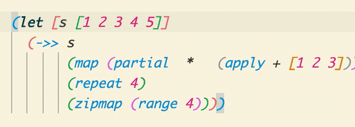 This is currently not working 😢.
<kbd>alt</kbd> <kbd>backspace</kbd> | **Force Delete Backward** | Deletes one character backwards, even if it will unbalance a form.   
<kbd>alt</kbd> <kbd>delete</kbd>    | **Force Delete Forward** | Deletes one character forwards, even if it will unbalance a form.   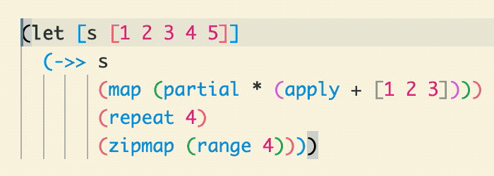

## About the Keyboard Shortcuts

Care has been put in to making the default keybindings somewhat logical, easy to use, and work with most keyboard layouts. Slurp and barf forward are extra accessible to go with the recommendation to learn using these two super handy editing commands.

Note: You can choose to disable all default key bindings by configuring `calva.paredit.defaultKeyMap` to `none`. (Then you probably also want to register your own shortcuts for the commands you often use.)

If you add your own key bindings, please be aware that chorded shortcuts will work badly in the the REPL window. Please avoid.

Happy Editing! ❤️