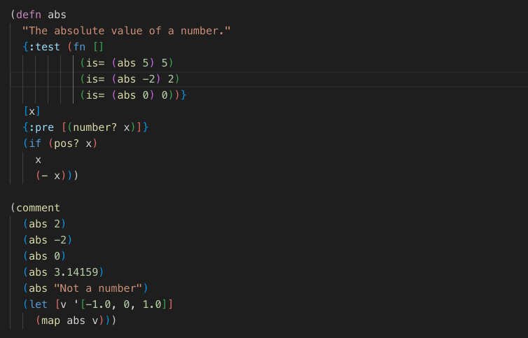

# Code Evaluation

Calva tries to make it easy to evaluate code, supporting interactive development. The fastest path to learning about it is to use the **Fire up the Getting Started REPL** command, which you can learn more about in the [Getting Started](getting-started.md) section.

NB: _The below assumes you have read about [Finding Calva Commands and Shortcuts](finding-commands.md)._

## Evaluation in a File Editor

Calva has commands for evaluating the **current form** and the **current top-level form**.

You can also choose what should happen with the results:

1. **Inline.** This will display the results (or some of it, if it is long) inline in the editor. _You find the full results in the [output window](output.md)_, from where it is easy to copy it to the clipboard.
1. **To comments.** This will add the results as comment lines below the current line.
1. **Replace the evaluated code.** This will do what it says, the evaluated code will be replaced with its results.

## Wait, Current Form? Top-level Form?

These are important concepts in Calva in order for you to create your most effective workflow.

### Current Form

Default shortcut for evaluating the current form: `ctrl+enter`.

The current form either means the current selection, or otherwise is based on the cursor position. Play some with the command **Calva: Select current form**, `ctrl+alt+c s`, to figure out what Calva thinks is the current form for some different situations. Try it inside a symbol, adjacent to a symbol (both sides) and adjacent to an opening or closing bracket (again, both sides). Generally the current form is determined like so:

If text is selected, then that text

If the cursor is ”in” a symbol, then that symbol
```clojure
foob|ar ; foobar
```

If the cursor is adjacent to a form (a symbol or a list of some kind), then that form
```clojure
(foo bar |(baz)) ; (baz)
```

If the cursor is between to forms, then the left side form
```clojure
(foo bar | (baz)) ; bar
```

If the cursor is before the first form of a line, then that form
```clojure
(foo
 | bar (baz)) ; bar
```

### Current Top-level Form

Default shortcut for evaluating the current top level form: `alt+enter`.

The current top-level form means top-level in a structural sense. It is _not_ the topmost form in the file. Typically in a Clojure file you will find `def` and `defn` (and `defwhatever`) forms at the top level, but it can be any form not enclosed in any other form.

An exception is the `comment` form. It will create a new top level context, so that any forms immediately inside a `(commment ...)` form will be considered top-level by Calva. This is to support a workflow where you

1. Iterate on your functions.
2. Evaluate the function (top level).
3. Put them to test with expressions inside a `comment` form.
4. Repeat from *1.*, until the function does what you want it to do.

Here's a demo of the last repetition of such a workflow, for a simple implementation of the `abs` function:



### Evaluate to Cursor

There is also a command for evaluating the text from the start of the current list to where the cursor is. Convenient for checking intermediate results in thread or `doto`, or similar pipelines. The cursor is right behind `:d` in this form:

```clojure
  (->> [1 1 2 3 5 8 13 21]
       (partition 2)
       (zipmap [:a :b :c :d])
       :d| ; => (12 21)
       (apply -)
       (Math/abs))
```

The default shortcut for this command is `ctrl+alt+enter`.

### Evaluate Top Level Form to Cursor

This command has a default shortcut keybinding of `ctrl+shift+alt+enter`. It will create a form from the start of the current top level form, up to the cursor, then fold the form, closing all brackets, and this will then be evaluated. Good for examining code blocks up to a certain point.

Take this example and paste it in a file loaded into the REPL, then place the cursor in front of each line comment and try the command.

```clojure
(comment
 (do
   (def colt-express
     {:name "Colt Express"
      :categories ["Family"
                   "Strategy"]
      :play-time 40
      :ratings {:pez 5.0
                :kat 5.0
                :wiw 5.0   ; 1, then eval `colt-express`
                :vig 3.0
                :rex 5.0
                :lun 4.0}})

   (defn average [coll]
     (/ (apply + coll) (count coll)))

   (let [foo-express (-> colt-express
                         (assoc :name "Foo Express")
                         (assoc-in [:ratings :lyr] 5.0)
                         (update-in [:ratings :vig] inc))]
     (->> foo-express   ; 2
          :ratings      ; 3
          vals          ; 4
          average       ; 5
          ))))
```

### Evaluate Enclosing Form

The default keyboard shortcut for evaluating the current enclosing form (the list the cursor is in) is `ctrl+shift+enter`.

```clojure
(let [foo :bar]
  (when false (str| foo))) ; => ":bar"
```

### Copying the inline results

There is a command called **Copy last evaluation results**, `ctrl+alt+c ctrl+c`.

This works regardless if you have evaluated in a file editor or in a REPL window.

## Evaluating in a REPL window

Since the REPL Window is mostly just a regular file, things work pretty similar at the REPL prompt. You use `alt+enter` to evaluate. Selecting the current form (default key binding `ctrl+w` on Mac and `shift+alt+right` on Windows and Linux) after evaluating will select the result.
