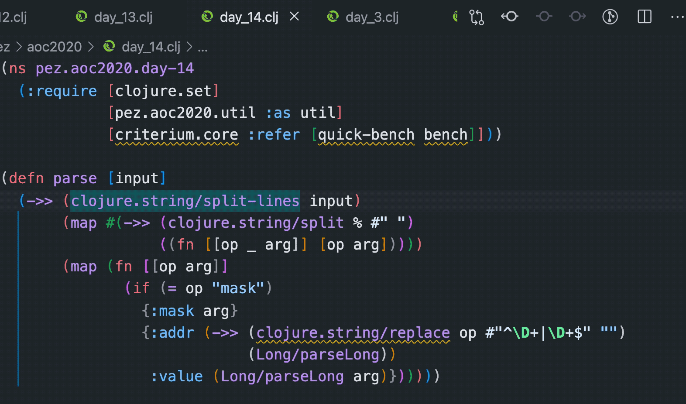
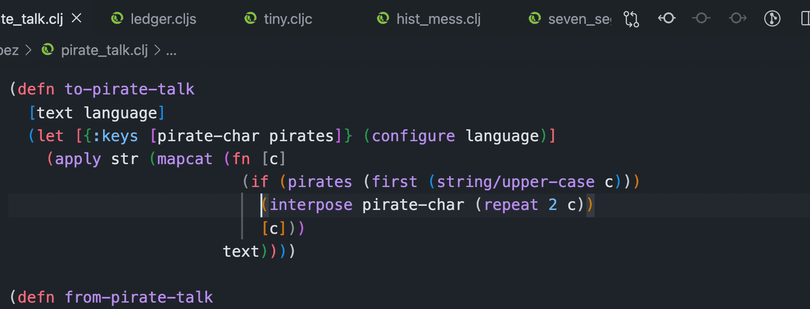
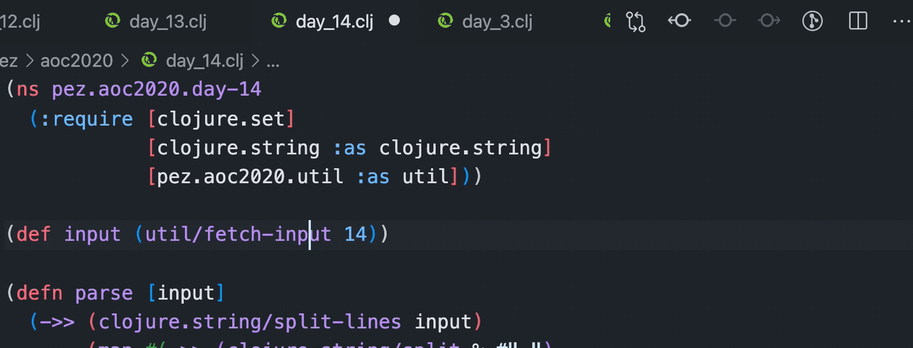
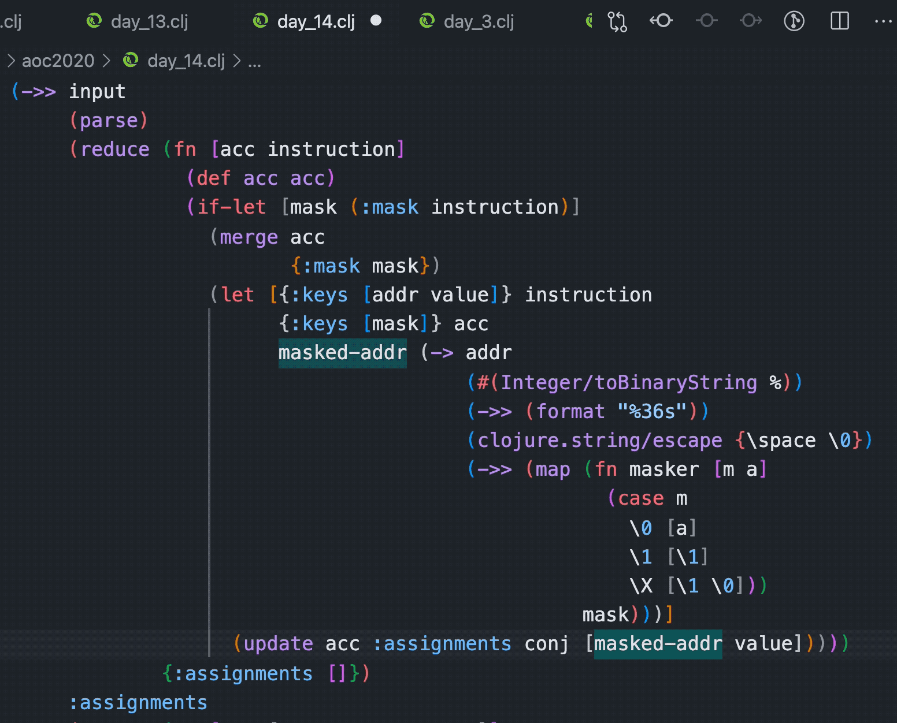
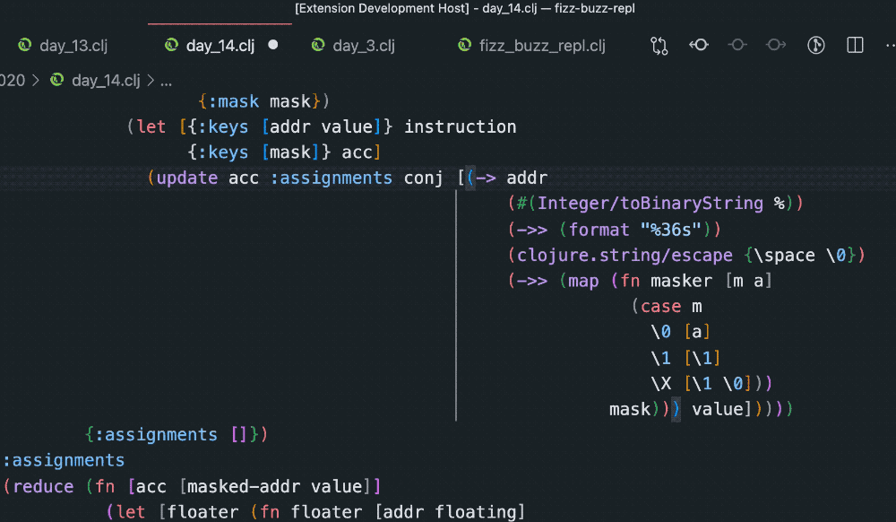

# Refactoring

There are two ”flavours” to refactoring support. Some (just a few) refactorings are made available as _Quick Fix_ suggestions (the light bulb), the rest are regular commands in the *Calva Refactoring* category.

You can enable or disable the _Quick Fix_ suggestion lightbulb using the VS Code setting `editor.lightbulb.enabled`.

The refactoring commands do not have default keyboard shortcuts. You find them all by typing ”Calva Refactoring” in the Command Palette.

## Commands

Command Title | Command Key | Description
------------- | ----------- | -----------
Clean NS Form | `calva.refactor.cleanNs` | 
Add Missing Require | `calva.refactor.addMissingLibspec` | 
Extract to New Function | `calva.refactor.extractFunction` | 
Cycle/Toggle Privacy | `calva.refactor.cyclePrivacy` | 
Inline Symbol | `calva.refactor.inlineSymbol` | 
Introduce let | `calva.refactor.introduceLet` | Creates a new let box with the binding. Follow up with ”Expand let” to move it upwards. 
Expand Let | `calva.refactor.expandLet` | 
Move to Previous let Box | `calva.refactor.moveToLet` | 
Thread First | `calva.refactor.threadFirst` | 
Thread First All | `calva.refactor.threadFirstAll` | 
Thread Last | `calva.refactor.threadLast` | 
Thread Last All | `calva.refactor.threadLastAll` | 
Unwind All | `calva.refactor.unwindAll` | 
Unwind Thread | `calva.refactor.unwindThread` | 

## Thanks to clojure-lsp

Most of Calva's refactoring support is sourced directly from [clojure-lsp](https://github.com/snoe/clojure-lsp). This also means that most often, if you find issues with refactoring, or have suggestions about it, the clojure-lsp repo is where to direct your reporting.